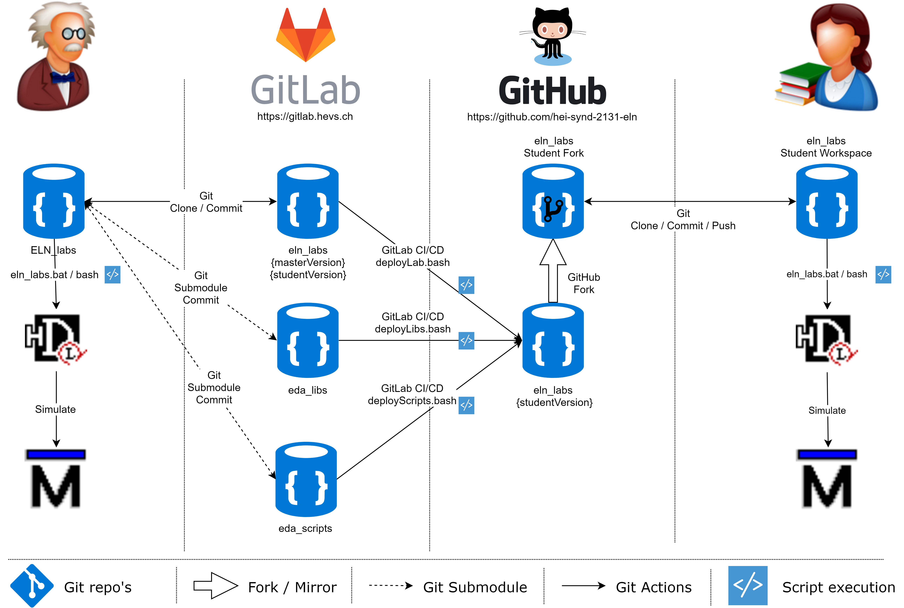

<h1 align="center">
  <br>
  
  <br>
  Hevs EDA Scripts
  <br>
</h1>

<h4 align="center">Common Files and Scripts for ELN Laboratories practical sessions.</h4>

[](https://gitlab.hevs.ch/course/ElN/eda_scripts/commits/master)
[](https://gitlab.hevs.ch/course/ElN/eda_scripts/commits/master)

# Table of contents
<p align="center">
  <a href="#description">Description</a> •
  <a href="#how-to-use">How To Use</a> •
  <a href="#download">Download</a> •
  <a href="#credits">Credits</a> •
  <a href="#license">License</a>
  <a href="#find-us-on">Find us on</a>
</p>

## Description
[(Back to top)](#table-of-contents)

These scripts can be used as for:
**Git Repos**
* [EDA_libs](https://gitlab.hevs.ch/course/ElN/eda_libs.git)
* [ELN_labs](https://gitlab.hevs.ch/course/ElN/eln_labs.git)
* [SEm_exams](https://gitlab.hevs.ch/course/SEm/exams.git)
* [ELN_chrono](https://gitlab.hevs.ch/course/ElN/eln_chrono.git)
* [ELN_cursor](https://gitlab.hevs.ch/course/ElN/eln_cursor.git)
* [ELN_kart](https://gitlab.hevs.ch/course/ElN/eln_kart.git)
* [ELN_inverter](https://gitlab.hevs.ch/course/ElN/eln_inverter.git)
* [ELN_synchro](https://gitlab.hevs.ch/course/ElN/eln_synchro.git)
* [SEm_labs](https://gitlab.hevs.ch/course/SEm/sem_labs.git)

**SVN Repos**
* [CanSat](https://repos.hevs.ch/svn/eda/VHDL/labs/CanSat) (TODO) :rotating_light:
* [ELN_support](https://repos.hevs.ch/svn/eda/VHDL/labs/ELN_support) (TODO) :rotating_light:
* [EPTM_AudioAmp](https://repos.hevs.ch/svn/eda/VHDL/labs/AudioAmp) (TODO) :rotating_light:
* [EPTM_Radio](https://repos.hevs.ch/svn/eda/VHDL/labs/EPTM_radio) (TODO) :rotating_light:
* ...

### Files
**Linux**
* ``changeDefaultViews.bash`` - Changes RTL <=> studentVersion
  * Usage master => student: ``changeDefaultViews.bash -v -a masterVersion -n studentVersion``
  * Usage master => student: ``changeDefaultViews.bash -v -a master@version -n student@version``
  * Usage student => master: ``changeDefaultViews.bash -v -a studentVersion -n masterVersion``
  * Usage student => master: ``changeDefaultViews.bash -v -a student@version -n master@version``
  * Note: use the ``-r`` otion to also delete the specified actual_view
* ``cleanGenerated.bash`` - Deletes all intermediate files
  * Usage: ``./cleanGenerated.bash``
* ``hdlDesigner.bash`` - Main script for starting HDL-Designer
* ``deployLibs.bash`` - Execution from eln_libs repo, copy required libraries to student repo and commit/push it.
  * Usage: ``./Scripts/deployLibs.bash -v -p synd_eln_labs -r https://github.com/hei-synd-2131-eln/eln_labs.git``
* ``deployLibsAll.bash`` - Execution from eln_libs repo, copy required libraries to all student repo's and commit/push it.
  * Usage: ``./Scripts/deployLibsAll.bash``
* ``deployLab.bash`` - Execution from Laborepo, copy required laboratory files to student repo and commits/push it.
  * Usage: ``./Scripts/deployLab.bash -v -p synd_eln_labs -r https://github.com/hei-synd-2131-eln/eln_labs.git``
* ``deployScripts.bash`` - Copy required scripts to student repo and commits/push it.
  * Usage: ``./deployScripts.bash -v -p synd_eln_labs -r https://github.com/hei-synd-2131-eln/eln_labs.git``
* ``deployScriptsAll.bash`` - Execution from eln_scripts repo, copy required scripts to all student repo's and commit/push it.
  * Usage: ``./deployScriptsAll.bash``

**Windows**
* ``cleanGenerated.bat`` - Deletes all intermediate files
  * Usage: ``./cleanGenerated.bat``
* ``cleanScratch.bat`` - Delete scratch directory
  * Usage:
``` bash
set SCRATCH_DIR=C:\temp\eda\%username%
./cleanScratch.bat
```

* ``hdlDesigner.bat`` - Main script for starting HDL-Designer
* ``searchPaths.bat`` - Search for required Libraries and tools
  * Usage:
``` bash
:: Define required Tools to be present
set REQUIRE_LIBS=1
set REQUIRE_HDS=1
set REQUIRE_MODELSIM=1
set REQUIRE_ISE=1
set REQUIRE_LIBERO=0
set HEI_LIBS_DIR=R:\SYND\Ele_2131\ELN\Labs\Libraries
set HDS_HOME=C:\eda\MentorGraphics\HDS
set MODELSIM_HOME=C:\eda\MentorGraphics\Modelsim\win64
set ISE_VERSION=14.7
set ISE_HOME=C:\eda\Xilinx\%ISE_VERSION%\ISE_DS\ISE
set LIBERO_HOME=C:\eda\Microsemi\Libero
set design_name=eln_labs
./searchPaths.bat
```

**Perl Scripts**
Perl scripts are used to launch different tasks from HDL-Designer
* ``trimLibs.pl`` - Comment regular libraries in an concatenated file
  * Parameter : ``trimlibs.pl <Input File Name> <Output File Name>``
* ``update_ise.pl`` -
  * Parameter : ``update_ise.pl <ISE File Spec> <VHDL File Spec> <UCF File Spec>``
* ``update_libero.pl`` -
  * Parameter : ``update_libero.pl <Libero File Spec> <VHDL File Spec> <PDC File Spec>``
* ``start_libero.pl`` -
  * Parameter : ``start_libero.pl <Libero File Spec>``

## How To Use
[(Back to top)](#table-of-contents)

To clone and run this application, you'll need [Git](https://git-scm.com) installed on your computer.
This repo is normally used as submodule to the laboratories and projects.

To deploy the studentVersion to github cd to root of Labor master repo:
```bash
cd eln_labs
./Scripts/deployLab.bash -v -p synd_eln_labs -r https://github.com/hei-synd-2131-eln/eln_labs.git
./Scripts/deployLab.bash -v -p ete_eln_labs -r https://github.com/hei-ete-8132-eln/eln_labs.git

cd sem_labs
./Scripts/deployLab.bash -v -p sem_labs -r sem_labs -r https://github.com/hei-synd-225-sem/sem_labs.git -d 01-WaveformGenerator
./Scripts/deployLab.bash -v -p sem_labs -r sem_labs -r https://github.com/hei-synd-225-sem/sem_labs.git -d 02-SplineInterpolator
./Scripts/deployLab.bash -v -p sem_labs -r sem_labs -r https://github.com/hei-synd-225-sem/sem_labs.git -d 03-DigitalToAnalogConverter
./Scripts/deployLab.bash -v -p sem_labs -r sem_labs -r https://github.com/hei-synd-225-sem/sem_labs.git -d 04-Lissajous
./Scripts/deployLab.bash -v -p sem_labs -r sem_labs -r https://github.com/hei-synd-225-sem/sem_labs.git -d 05-Morse
./Scripts/deployLab.bash -v -p sem_labs -r sem_labs -r https://github.com/hei-synd-225-sem/sem_labs.git -d 06-07-08-09-SystemOnChip
./Scripts/deployLab.bash -v -p sem_labs -r sem_labs -r https://github.com/hei-synd-225-sem/sem_labs.git -d 10-PipelinedOperators

cd eln_chrono
./Scripts/deployLab.bash -v -p eln_chrono -r https://github.com/hei-synd-2131-eln/eln_chrono.git

cd eln_cursor
./Scripts/deployLab.bash -v -p eln_cursor -r https://github.com/hei-synd-2131-eln/eln_cursor.git
```

To deploy the Libraries to github cd to root of Libs master repo:
```bash
./Scripts/deployLibs.bash -v -p synd_eln_labs -r https://github.com/hei-synd-2131-eln/eln_labs.git
./Scripts/deployLibs.bash -v -p ete_eln_labs -r https://github.com/hei-ete-8132-eln/eln_labs.git
./Scripts/deployLibs.bash -v -p sem_labs -r https://github.com/hei-synd-225-sem/sem_labs.git
./Scripts/deployLibs.bash -v -p eln_chrono -r https://github.com/hei-synd-2131-eln/eln_chrono.git
./Scripts/deployLibs.bash -v -p eln_cursor -r https://github.com/hei-synd-2131-eln/eln_cursor.git
./Scripts/deployLibs.bash -v -p eln_kart -r https://github.com/hei-synd-2131-eln/eln_kart.git
./Scripts/deployLibs.bash -v -p eln_inverter -r https://github.com/hei-synd-2131-eln/eln_inverter.git
./Scripts/deployLibs.bash -v -p eln_synchro -r https://github.com/hei-synd-2131-eln/eln_synchro.git
# or
./Scripts/deployLibsAll.bash
```

To deploy the Scripts to github cd root of Scripts master Repo
```bash
./deployScripts.bash -v -p synd_eln_labs -r https://github.com/hei-synd-2131-eln/eln_labs.git
./deployScripts.bash -v -p ete_eln_labs -r https://github.com/hei-ete-8132-eln/eln_labs.git
./deployScripts.bash -v -p sem_labs -r https://github.com/hei-synd-225-sem/sem_labs.git
./deployScripts.bash -v -p eln_chrono -r https://github.com/hei-synd-2131-eln/eln_chrono.git
./deployScripts.bash -v -p eln_cursor -r https://github.com/hei-synd-2131-eln/eln_cursor.git
./deployScripts.bash -v -p eln_kart -r https://github.com/hei-synd-2131-eln/eln_kart.git
./deployScripts.bash -v -p eln_inverter -r https://github.com/hei-synd-2131-eln/eln_inverter.git
./deployScripts.bash -v -p eln_synchro -r https://github.com/hei-synd-2131-eln/eln_synchro.git
# or
./deployScriptsAll.bash
```

<div align="center">

</div>

### Download
```bash
# Clone repo including submodules
git clone --recursive <repo_url>
```

### Pull changes repo and submodules
```bash
# Pull all changes in the repo including changes in the submodules (of given commit)
git pull --recurse-submodules
```

#### Update to latest commit
Update submodule to latest commit and update parentrepo
```bash
# Update submodule to latest commit
git submodule update --remote --merge

# Afterwared you need to commit in the parentrepo the new pointer to the new commit in the submodule
git commit -am "Update submodule to latest commit"
```

### Add submodule
If the folder ``Scripts`` already exists, delete it and commit these changes. 
Add submodule and define the master branch as the one you want to track
```bash
git submodule add -b master <repo_url> <relative/path/to/folder>
git submodule add -b master https://gitlab.hevs.ch/course/ElN/eda_scripts.git Scripts
git submodule add -b master https://gitlab.hevs.ch/course/ElN/eda_libs.git Libs

git submodule init

git submodule update
```

## Credits
[(Back to top)](#table-of-contents)
* COF
* PRC
* ZAS

## License
[(Back to top)](#table-of-contents)

:copyright: [All rights reserved](LICENSE)

---

## Find us on
> Website [hevs.ch](https://www.hevs.ch) &nbsp;&middot;&nbsp;
> Facebook [@hessovalais](https://www.facebook.com/hessovalais) &nbsp;&middot;&nbsp;
> Twitter [@hessovalais](https://twitter.com/hessovalais) &nbsp;&middot;&nbsp;
> LinkedIn [HES-SO Valais-Wallis](https://www.linkedin.com/groups/104343/) &nbsp;&middot;&nbsp;
> Youtube [HES-SO Valais-Wallis](https://www.youtube.com/user/HESSOVS)